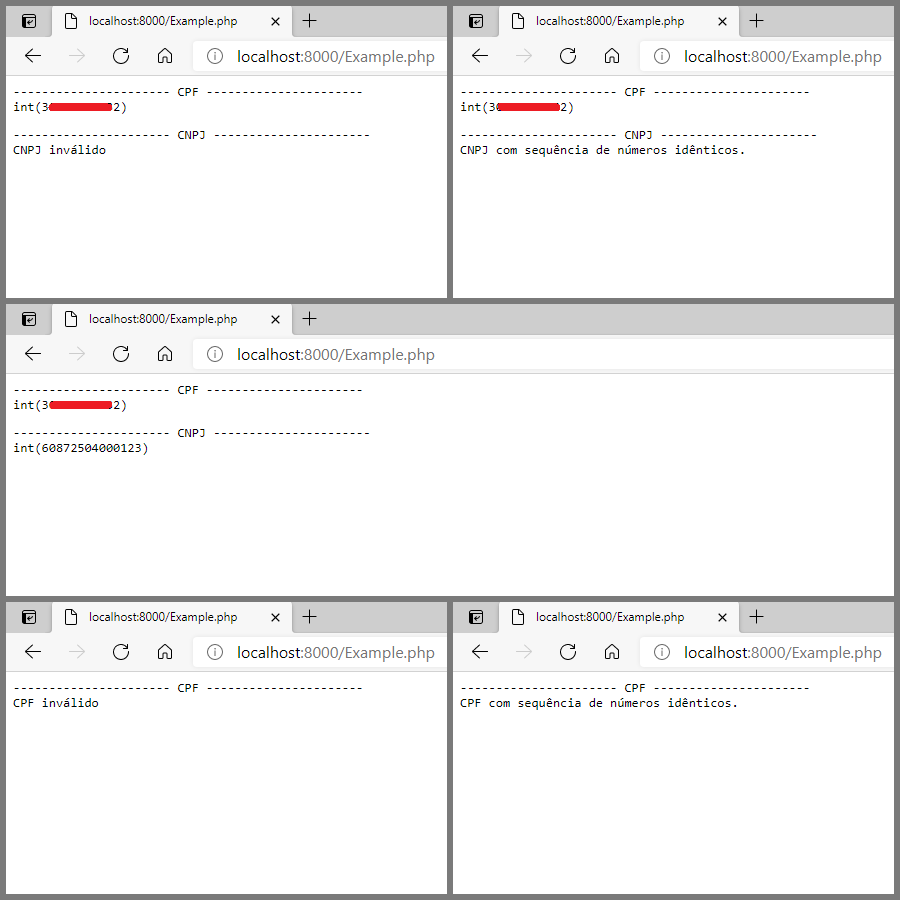

 

# Valida DocumentoX

Biblioteca para validação de documentos (CPF, RG e CNPJ).

## Install

**Método 1**. Adicione ao arquivo **composer.json** o trecho abaixo, após isso execute o **install** ou **update** do composer.
```bash
"require": {
        "emso-exe/valida_documentox": "dev-master"
    }
```

**Método 2**. No diretório do seu projeto execute o comando abaixo, será atualizado o arquivo **composer.json**.
```bash 
composer require emso-exe/validaDocumentoX
```

**Método 3**. No diretório do seu projeto execute o comando abaixo, será necessário que faça modificações no seu projeto.
```bash
git clone https://github.com/emso-exe/Valida_DocumentoX.git
```

## Tecnologias

- PHP

## Teste

**Método 1**. No diretório Valida_DocumentoX via terminal.
```bash
php ExampleCPF.php
php ExampleCNPJ.php
```
**Método 2**. Com o servidor web, por exemplo do PHP, ativado.
```php
http://localhost:8000/ExampleCPF.php
http://localhost:8000/ExampleCNPJ.php
```

## ExampleCPF.php e ExampleCNPJ.php em execução

 

## Créditos

- [Estênio Mariano](https://github.com/emso-exe)

## Licença

Licença MIT (MIT). Por favor leia o [arquivo da licença](LICENSE.md) para mais informações.
